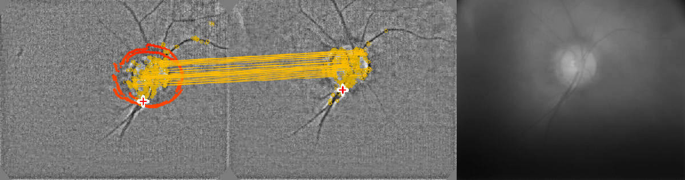

# FALCO Retinal Tracking

## Overview

A minimal implementation of the retinal tracking described by:

> D. Mendroch, D. Harings, N. Bauer, S. Altmeyer, U. Oberheide, and A. Heisterkamp, "Robust real-time retinal tracking for ophthalmic applications", Ophthalmic Technologies XXXV, SPIE, 2025. [Link](https://spie.org/photonics-west/presentation/Robust-real-time-retinal-tracking-for-opthalmic-applications/13300-74)

*Example frame with the raw input on the right, the preprocessed frame in the center and the reference frame on the left*

A demonstration video is available [here](https://figshare.com/articles/media/FALCO_Retinal_Tracking_-_Demonstration_Videos/28053002?file=51272465).

The tracking has also been featured in:

> D. Harings, N. Bauer, D. Mendroch, U. Oberheide, and H. Lubatschowski, "Precise control of eye movement for real-time video funduscopy and OCT using dynamic fixation patterns", Ophthalmic Technologies XXXV, SPIE, 2025. [Link](https://spie.org/photonics-west/presentation/Precise-control-of-eye-movement-for-real-time-video-funduscopy/13300-59)

> D. Harings, N. Bauer, D. Mendroch, U. Oberheide, and H. Lubatschowski, "Real-time video funduscopy with continuously moving fixation target", Biomedical Spectroscopy, Microscopy, and Imaging III, SPIE, 2024. [Official Link](https://doi.org/10.1117/12.3017223) [Free Preprint](https://nbn-resolving.org/urn:nbn:de:hbz:832-epub4-27891)

This research is part of the [FALCO project](https://www.th-koeln.de/informations-medien-und-elektrotechnik/institute/aoe/forschungsprojekt-falco_101841.php) (Fourier-Algorithm based Low-Cost OCT) at the TH Köln University of Applied Sciences, Cologne, Germany.

## Instructions

1. Install Python >= 3.11 and the packages numpy, opencv-python
2. Download/clone this repository
3. Download this [raw sample video](https://figshare.com/articles/media/FALCO_Retinal_Tracking_-_Example_Raw_File/28052897?file=51271970) and store it in the same folder
4. Run the `tracking.py` script with the python interpreter

This displays a live tracking visualization.
Pause/resume the video by pressing `space`. Quit the view by pressing `q`.
At the end an overview image with all detected positions will be displayed.

## Adapting and Extending the Tracking

This implementation provides a minimal version for the reproduction of our results.
It does not include the code for the real-time access or parametrization of the camera, nor does it include the storage of the reference image or the recording of the raw and tracked video.

When using your own raw data, the raw video should be stored as uncompressed as possible.
Compression leads to quantization artifacts that will be strongly visible after preprocessing and will negatively impact tracking.

For different applications, a few processing parameters should be adapted:
* Depending on the size of relevant structures, the output frame size `opts["res"]` and the filter constant `opts["kernel_size"]` must be changed.
* Depending on the physical construction of the funduscope, the circular mask must be adapted by parameters `opts["mask_r"], opts["mask_pos"]`.
* Reflection removal is parametrized by `opts["reflect_th"], opts["reflect_dilate"]`.
* Increase the number of maximum ORB keypoints with the `opts["fdet_args"]` parameter.
  This typically decreases the performance, but improves matching results.
* However, the filtering criteria must be fine-tuned with the parameters `opts["min_matches"], opts["match_std_th"]` for a low number of misdetections.

## License

This program is published under an MIT license.

